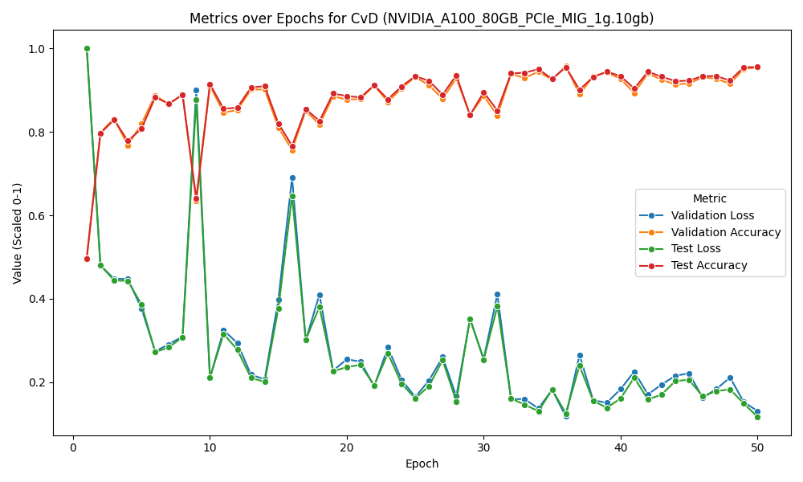
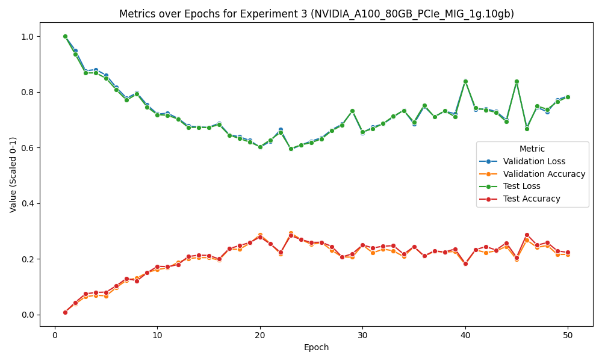
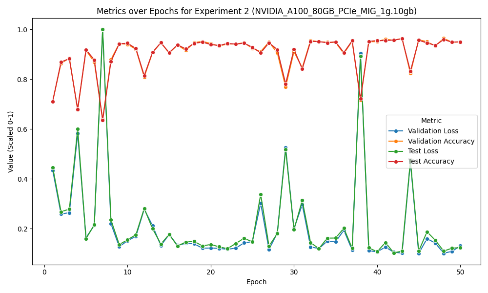
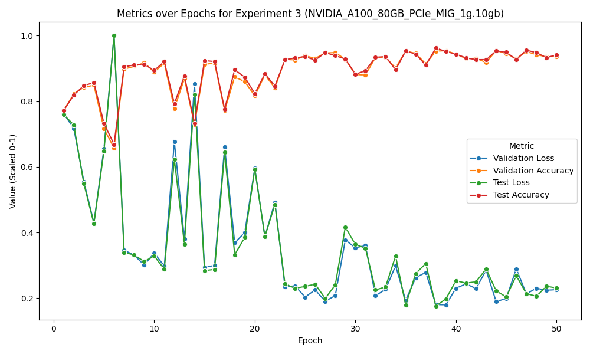
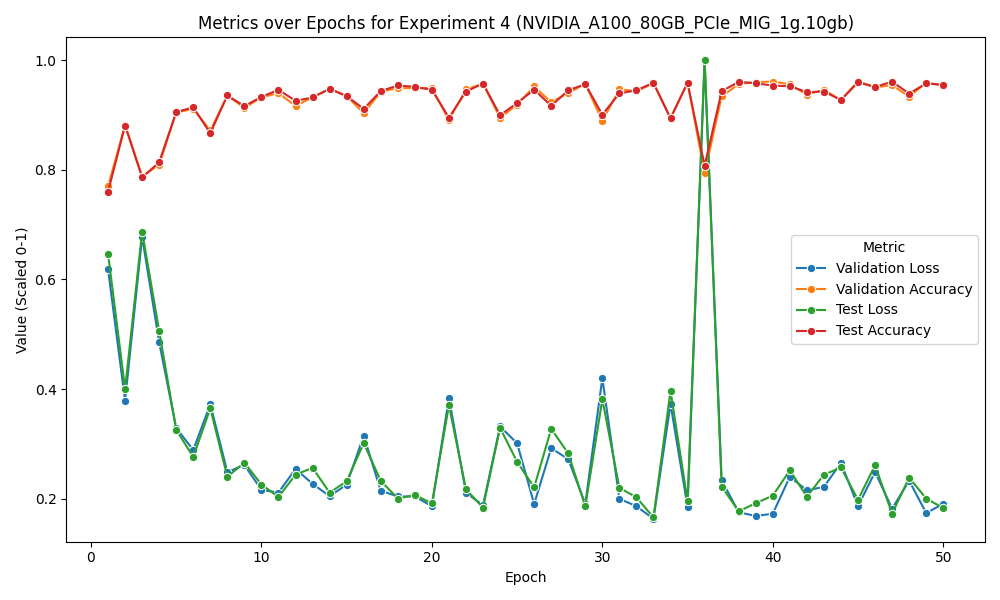

# transfer_learning

## Introduction
This repository uses the Cats vs Dogs and Stanford Dogs dataset, the goal is to to train CNN's and explore transfer learning in Keras.

## Datasets
The datasets can be aquired [Cats vs Dogs](https://www.kaggle.com/datasets/vishnupriyanss/cat-vs-dog-kagglecatsanddogs-5340) and [Stanford dogs](https://www.tensorflow.org/datasets/catalog/stanford_dogs) here.

## Enviroment
In this project Python version 3.12.3 has been used, create a Python virtual enviroment and run ```pip install -r requirements.txt``` in order to install all required packages and libraries required for this project.

## Experiments conducted

There were 4 experiments conducted in this project on various hardware, the ones we highlight has been ran on a ```NVIDIA_A100_80GB_PCIe_MIG_1g.10gb```. The experiments will have a short breakdown below.

### Experiment 1
During the first experiment, two convolutional neural network (CNN) models were created according to the architecture in this [guide](https://keras.io/examples/vision/image_classification_from_scratch/) and trained for 50 epochs on the Cats vs Dogs and Stanford dogs datasets separately, resulting in the Cats vs Dogs (CvD) model and the Stanford model, respectively.

<div align="center">
  
  
  <p><strong>Figure 1:</strong> Left - CvD base model, Right - Stanford base model</p>
</div>

### Experiment 2
In the second experiment, the trained Stanford model from the first experiment was modified by replacing its output layer, from classifying 120 classes to classifying two classes, and then trained for 50 epochs on the Cats vs Dogs dataset, yielding a better result compared to the base CvD model.

<div align="center">
  
  <p><strong>Figure 2:</strong> Experiment 2 – Output layer replaced, fine-tuned on CvD</p>
</div>

### Experiment 3
The third experiment involved further modifying the Stanford model by resetting its first two convolutional layers, specifically re-initializing the weights and biases of these layers using the Xavier initialization method, and training the model for 50 epochs on the Cats vs Dogs dataset.

<div align="center">
  
  <p><strong>Figure 3:</strong> Experiment 3 – First two convolutional layers re-initialized</p>
</div>

### Experiment 4
Finally, in the fourth experiment, we replaced the last two layers of the Stanford model using the same method as in Experiment 3 and trained this modified model on the Cats vs Dogs dataset for 50 epochs.

<div align="center">
  
  <p><strong>Figure 4:</strong> Experiment 4 – Last two convolutional layers re-initialized</p>
</div>

## Results

Among all models, Experiment 2 achieved the best test accuracy 96.23%, outperforming both the baseline CvD model 95.55% and the other transfer learning strategies. Experiment 4 performed slightly worse than experiment 2 on the test accuracy 96.09%, as well as experiment 3 which showed a minor drop in performance 96.20%. These results indicate that in this case, fine-tuning the later layers of the pre-trained Stanford model yielded no significant advantage for transfer learning in test accuracy context. Although the base CvD model already performed strongly, we expected that resetting the convolutional layers in experiments 3 and 4 would allow the model to learn more task-specific, high-level features and thus perform even better. However, the results indicate that this modification did not lead to any improvement in performance in the end. It is worth noting that the accuracy during the early epochs of training is higher in Experiments 2, 3, and 4 compared to the CvD baseline model. This suggests that transfer learning can be beneficial in scenarios with limited amounts of data. Further details of the results can be found in the ```results``` directory.